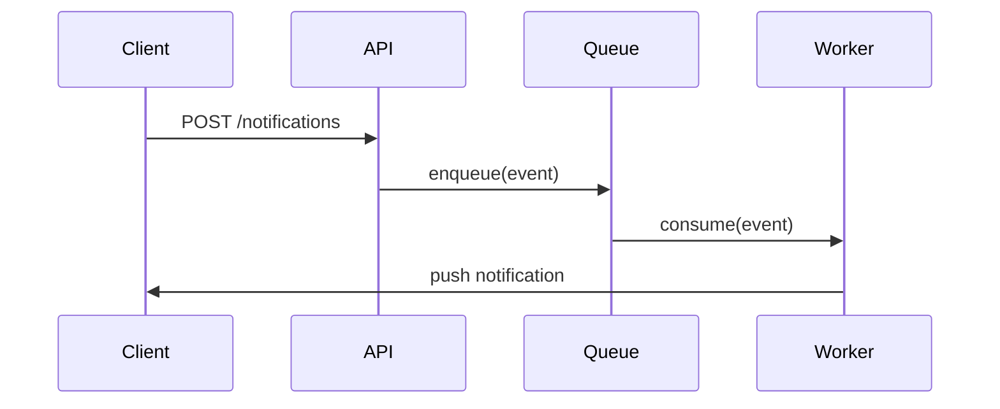

# TDD Template

The full Technical Design Document template. Copy this structure for each new TDD. Fill in your content and delete the guidance blocks before sharing. Sections marked **[REQUIRED]** must be completed before review. Sections marked **[IF APPLICABLE]** complete where relevant.

---

## 1. Document Header [REQUIRED]

> Fill in all fields. Status options: `Draft` | `In Review` | `Approved` | `Superseded`

| Field                          | Value                                                     |
| ------------------------------ | --------------------------------------------------------- |
| **Title**                | *(Name of the system or feature being designed)*        |
| **Status**               | Draft                                                     |
| **Author(s)**            | *(Name(s) and team(s))*                                 |
| **Tech Shepherd**        | *(Name and team)*                                       |
| **Reviewers**            | *(Name(s) and team(s))*                                 |
| **SRE Contact**          | *(Required for production services)*                    |
| **Security Reviewer**    | *(Required for new external surface or data handling)*  |
| **Created**              | *(Date)*                                                |
| **Last Updated**         | *(Date)*                                                |
| **Target Review Date**   | *(Date)*                                                |
| **Related Docs**         | *(Links to prior designs, RFCs, tickets, launch plans)* |
| **Slack / Mailing List** | *(Where to follow discussion)*                          |

---

## 2. Overview [REQUIRED]

> Write a concise summary of what you are building and why. Aim for 2–4 paragraphs. A reviewer should be able to read this section alone and understand the problem, the proposed solution, and the scope. Avoid implementation detail here. If you cannot explain it plainly, the design probably needs more thought.

*(Describe the problem being solved. What pain exists today? What is currently broken, slow, or missing?)*

*(Describe the proposed solution at a high level. What are you building? How does it address the problem?)*

*(State the scope clearly. What is in scope? What is explicitly out of scope?)*

---

## 3. Goals and Non-Goals [REQUIRED]

### 3.1 Goals

> Be concrete and measurable. "Improve performance" is not useful. "Reduce p99 latency from 800ms to under 200ms under normal load" is. Goals should be verifiable.

- *(Concrete, measurable goal 1)*
- *(Concrete, measurable goal 2)*
- *(Concrete, measurable goal 3)*

### 3.2 Non-Goals

> Be explicit about what this design does not cover. Non-goals prevent scope creep and stop reviewers asking "but what about X?" for things you have deliberately excluded. If something is a non-goal now but might be addressed later, say so.

- *(Thing this design deliberately does not address)*
- *(Adjacent problem left for a future design)*

---

## 4. Background and Context [REQUIRED]

> Provide only the context a reviewer needs to evaluate your design. Cover: the current state of the system, why the status quo is no longer acceptable, any prior attempts or related work, and key constraints the design must operate within.

### 4.1 Current State

*(Describe how things work today. Diagrams are encouraged. Link to existing systems if relevant.)*

### 4.2 Why This, Why Now

*(Explain the forcing function. Why is this the right time? What has changed?)*

### 4.3 Prior Art and Related Work

*(What has been tried before? What adjacent work is in flight? What external examples or open source projects are relevant?)*

---

## 5. Proposed Design [REQUIRED]

> Describe your solution in enough detail that an engineer unfamiliar with the area could evaluate whether it is sound. Use diagrams. Cover: system architecture, data model changes, API contracts, key algorithms or logic, and how components interact. Call out important design decisions explicitly — don't bury them in prose.

Example diagram:





### 5.1 Summary

*(1–3 paragraphs on the proposed approach. What are the key decisions? What makes this design distinct from alternatives?)*

### 5.2 Architecture / Components

*(Describe the components, services, or layers involved. A system diagram belongs here. Explain the responsibilities of each component and how data flows between them.)*

### 5.3 API Design [IF APPLICABLE]

> Document any new or changed APIs — internal or external. Include: endpoint paths and methods, request/response shapes with example payloads, auth model, versioning strategy, and backwards compatibility. API design is a contract — treat it seriously.

*(Document API contracts here. Include example requests and responses, see example below.)*

#### New or Modified Endpoints

**`POST /v1/notifications`**

```json
{
  "user_id": "string",
  "type": "credit_alert | score_change",
  "payload": { "...": "..." }
}
```

**Response `201 Created`:**

```json
{
  "notification_id": "string",
  "status": "pending"
}
```

**Error responses:**

| Status  | Condition              |
| ------- | ---------------------- |
| `400` | Missing required field |
| `404` | `user_id` not found  |
| `429` | Rate limit exceeded    |
| `500` | Internal error         |

### Event / Message Contracts [If applicable]

If this design produces or consumes Kafka events or other async messages, define the schema:

```json
{
  "event": "notification.created",
  "version": "1",
  "payload": {
    "notification_id": "string",
    "user_id": "string",
    "created_at": "ISO8601"
  }
}
```

### 5.4 Data Model [IF APPLICABLE]

> Describe any changes to persistent data: new tables, schema changes, new fields, deletions. Consider: migration strategy, backwards compatibility, data volume implications, and whether existing data needs backfilling.

```sql_more
-- Example
ALTER TABLE notifications ADD COLUMN delivery_status VARCHAR(20) NOT NULL DEFAULT 'pending'
  CHECK (delivery_status IN ('pending', 'delivered', 'failed'));
```

Or describe document schemas, event schemas, etc. as appropriate.

### 5.5 Key Design Decisions

> Call out the most significant decisions and your rationale. Pre-empt reviewer questions. For each decision, explain what options you considered and why you chose what you did. This prevents re-litigating decisions in review and serves as a record of why things are the way they are.

**Decision 1:** *(State the decision clearly)*

*(Options considered and why you chose this one.)*

**Decision 2:** *(State the decision clearly)*

*(Options considered and why you chose this one.)*

---

## 6. Alternatives Considered [REQUIRED]

> This section is not optional. It is one of the first things an experienced reviewer looks for. If you cannot articulate why you chose your approach over alternatives, the design may not be sufficiently thought through. Be honest about trade-offs.

### 6.1 Alternative 1: *(Name)*

*(Describe the alternative.)*

*(Why it was ruled out — be specific. "Didn't feel right" is not acceptable.)*

### 6.2 Alternative 2: *(Name)*

*(Describe the alternative.)*

*(Why it was ruled out.)*

---

## 7. Risks and Mitigations [REQUIRED]

> Identify all meaningful risks and how you plan to address them. Think across: reliability (what happens when components fail?), security (new attack surface?), data correctness, performance (worst-case load?), operability (how will on-call diagnose problems?), and reversibility (can we roll back?). A design with no identified risks is almost certainly incomplete.

| Risk                   | Likelihood       | Impact           | Mitigation                                      |
| ---------------------- | ---------------- | ---------------- | ----------------------------------------------- |
| *(Risk description)* | High / Med / Low | High / Med / Low | *(How you will prevent or reduce the impact)* |
| *(Risk description)* | High / Med / Low | High / Med / Low | *(How you will prevent or reduce the impact)* |
| *(Risk description)* | High / Med / Low | High / Med / Low | *(How you will prevent or reduce the impact)* |

> Security risks deserve their own sub-section if you are: exposing new external API surface, handling user data, changing auth/authz, or introducing new third-party dependencies. Loop in your security reviewer early — don't wait until the doc is complete.

---

## 8. Operational Considerations [REQUIRED]

> A design is only complete if it can be operated safely in production. Think about this from the perspective of an on-call engineer who has never seen this system before.

### 8.1 Observability

> What metrics will you emit? What dashboards will you create? What does healthy vs. unhealthy look like? Cover SLIs/SLOs, key signals to alert on, and how you'll diagnose a latency or error-rate regression.

- *(Key metric 1 and what it represents)*
- *(Key metric 2 and what it represents)*
- *(Alerting thresholds and who gets paged)*

### 8.2 Graceful Degradation

> What happens when this service, or a dependency, degrades or goes down? Can the system return partial results? Are there fallback paths? Can expensive features be disabled under load? A good design fails gracefully and doesn't propagate failures to unrelated parts of the system.

*(Describe degradation behaviour. Which dependencies are hard vs. soft? How do you handle timeouts, retries, and back-pressure?)*

### 8.3 Rollout Plan

> How will you roll this out safely? Dark launch, feature flags, gradual ramp, canary? For breaking changes, how are consumers migrated? If something goes wrong mid-rollout, what is the rollback procedure? Be specific.

*(Describe the rollout strategy step by step.)*

### 8.4 Capacity and Resource Estimates

> Estimate resource requirements. Order-of-magnitude is fine during design, but you need a credible estimate for CPU, memory, storage, network, and expected RPS. Explain how you arrived at these numbers. You'll need more precise figures before launch.

*(Describe expected load and resource requirements. Reference comparable systems where possible.)*

---

## 9. Testing Strategy [REQUIRED]

> Describe how you will verify the system works correctly and safely. Be specific about primary test cases — not just "we will write tests". If the system has external or cross-team dependencies, address how integration testing will be coordinated.

### 9.1 Unit and Integration Tests

*(What will be unit tested? What integration test cases are most critical?)*

### 9.2 Load and Performance Testing

*(How will you verify the system performs at scale? What are your performance targets? How will you generate representative test traffic?)*

### 9.3 Rollback and Recovery Testing

*(How will you verify the rollback procedure works before you need it? Have you tested losing a dependency? Partial failure modes?)*

---

## 10. Security and Privacy [IF APPLICABLE]

> Complete this section if the design: introduces new external API surface, processes or stores user data, changes auth/authz, introduces new service-to-service trust relationships, or adds new third-party dependencies. If in doubt, complete it anyway — security review is much cheaper before implementation than after.

### 10.1 Data Classification

*(What data does this system process or store? Is any of it sensitive, PII, or regulated? How is it protected in transit and at rest?)*

### 10.2 Authentication and Authorisation

*(How are callers authenticated? How is access controlled? Are there privileged operations, and how are they protected?)*

### 10.3 New Attack Surface

*(What new attack vectors does this design introduce? How are they mitigated?)*

### 10.4 Security Review

*(Link to security review ticket. Status: Not started | In progress | Complete)*

---

## 11. Open Questions

> List unresolved questions at time of writing. For each: what is the question, who owns the answer, and by when. All open questions must be resolved before approval. Don't list questions you already know the answer to.

1. *(Question)* — **Owner:** *(Name)* — **Needed by:** *(Date)*
2. *(Question)* — **Owner:** *(Name)* — **Needed by:** *(Date)*

---

## 12. Appendices [IF APPLICABLE]

> Use appendices for detailed supporting material that would interrupt the flow of the main document: sample API payloads, schema definitions, benchmark results, large diagrams, migration scripts. Link to appendices from the relevant section above.

### 12.1 Appendix A: *(Title)*

*(Detailed supporting material — e.g. sample queries, schema definitions, benchmark data.)*
